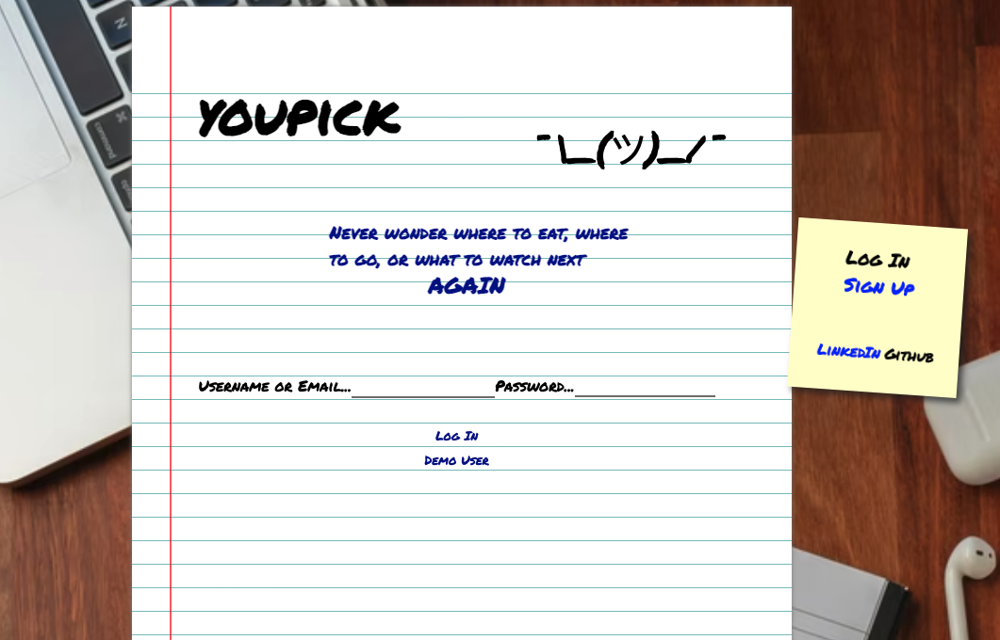
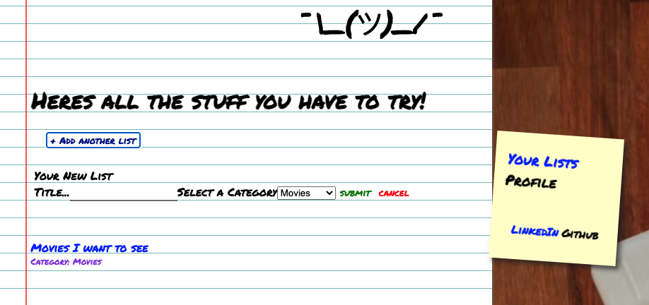

# youpick
Youpick is an app loosely based off of GoodReads or you basic note app. It allows users to create lists of movies, food, tv shows,
and travel ideas they have been meaning to try. Each list has the ideas of the user and a random idea selector to help especially
indecisive people choose whats next.

# Technology Used

<!-- # Technology Used
*express
*javascript
*react
*redux -->

# To get started:

1. Clone this repo
  * git clone https://github.com/philroberts13/youpick.git

2. Install dependencies
  * npm install

3. Create a POSTGRESQL user with CREATEDB and PASSWORD in PSQL.
  * CREATE USER <'name'> WITH CREATEDB PASSWORD <'password'>

4. Create a .env file in the backend directory based on the .env.example

5. Enter your username and password information into your .env file along with your desired database name, a
   secured combination of characters for your JWT_Secret, and your PORT(generally 5000)

6. Add the following proxy to your package.json file within your frontend directory, replacing or
   keeping the 5000 port to match your PORT configuration found in your .env file.
  * "proxy": "http://localhost:5000"

7. Create database, migrate, and seed models:
  * npx dotenv sequelize db:create
  * npx dotenv sequelize db:migrate
  * npx dotenv sequelize db:seed:all

8. Start backend server
  * npm start

9. Start frontend services, which should open the app in your default browser, if not navigate to http://localhost:3000/
  * npm start

10. A demo user button is available to use or you may create a new user account by clicking on "Sign up" in the nav bar.

# Features

# Lists

Users have full CRUD for lists that they have created, modals were incorported into the notepad background to allow for them to make/edit Lists on the same page that they are listed.
